Yapay Zeka İle İşe Alım Platformu

## 📌 Proje Tanımı

Aday Değerlendirme Sistemi, şirketlerin açtığı iş ilanlarına başvuran adayları yapay zeka modeli ile değerlendirerek ilgili iş ilanı için uygunluklarını belirleyen yenilikçi bir platformdur. Bu sistem, adayları ön eleme süreçlerinden geçirerek işe alım sürecini hızlandırır ve daha verimli hale getirir.

## 📋 İçindekiler

- [📌 Proje Tanımı](#📌-proje-tanımı)
- [💻 Kullanıcı Arayüzü](#💻-kullanıcı-arayüzü)
  - [📝 İlan Başvuru Formu](#📝-ilan-başvuru-formu)
  - [🔍 Kişiselleştirilmiş İş Öneri Sistemi](#🔍-kişiselleştirilmiş-iş-öneri-sistemi)
  - [📊 Aday Değerlendirme Sayfası](#📊-aday-değerlendirme-sayfası)
- [🔧 Admin Paneli](#🔧-admin-paneli)
  - [📈 Aday Değerlendirme](#📈-aday-değerlendirme)
  - [📉 Aday Başvuru Analizi](#📉-aday-başvuru-analizi)
  - [➕ İlan Ekleme ve ➖ Kaldırma](#➕-ilan-ekleme-ve-➖-kaldırma)
  - [📂 Açılan İlanlar](#📂-açılan-ilanlar)
  - [📄 Aday Başvuruları ve Özgeçmiş Havuzu](#📂-aday-başvuruları-ve-özgeçmiş-havuzu)
  - [🌍 Başvurulan Lokasyonlar](#🌍-başvurulan-lokasyonlar)
  - [👨‍💼 Yönetici Ekleme Sayfası](#👨‍💼-yönetici-ekleme)
- [🔒 Güvenlik Önlemleri](#🔒-güvenlik-önlemleri)
- [🛠️ Kullanılan Teknolojiler](#🛠️-kullanılan-teknolojiler)
- [📖 Kullanım](#📖-kullanım)

## 💻 Kullanıcı Arayüzü

### 📝 İlan Başvuru Formu

İlan başvuru sayfasında, şirketlerin açtığı iş pozisyonlarına başvururken özel olarak tasarlanmış özgeçmiş başvuru formunu doldurmanız gerekmektedir. Bu form, adayların kişisel bilgilerini, eğitim geçmişlerini, deneyimlerini ve yeteneklerini detaylı bir şekilde ifade etmelerini sağlar. Form ayrıca, arka planda çalışan yapay zeka modeline girdi verisi olarak kullanılır.

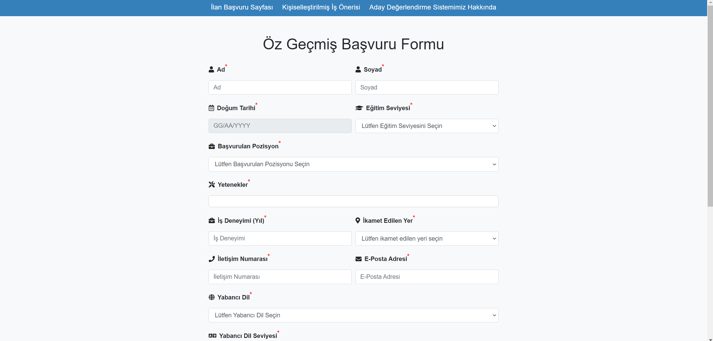

### 🔍 Kişiselleştirilmiş İş Öneri Sistemi

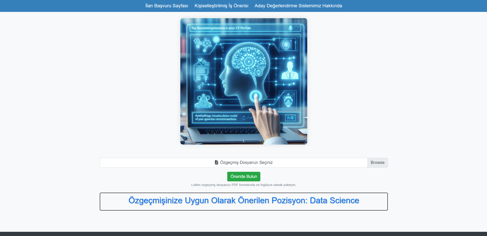

Kişiselleştirilmiş İş Öneri Sistemi sayfasında, adayların CV'lerini yükleyebilecekleri özel bir alan bulunmaktadır. Bu alana yüklenen CV'ler, yapay zeka modeli tarafından analiz edilerek kişinin en güçlü olduğu özellikler belirlenir ve adaya uygun iş önerisinde bulunulur. Aynı zamanda, güçlü oldukları alanlar ve geliştirmeleri gereken beceriler konusunda net geri bildirimler sağlanır. Bu sayede adaylar, kendi kariyer hedeflerine daha uygun iş fırsatlarını belirleme konusunda daha bilinçli kararlar alabilirler.

#### Model Detayları

- **Model:** Logistic Regression
- **Eğitim Verisi:** Java Developer, Testing, DevOps Engineer, Python Developer, Web Designer, HR, Hadoop, Blockchain, ETL Developer, Operations Manager, Data Science, Sales, Mechanical Engineer, Arts, Database, Electrical Engineering, Health and Fitness, PMO, Business Analyst, DotNet Developer, Automation Testing, Network Security Engineer, SAP Developer, Civil Engineer, Advocate pozisyonlarında çalışan adayların CV'leri
- **Ön İşleme Adımları:** Metindeki gramer hatalarının giderilmesi, tüm metnin küçük harflere dönüştürülmesi, özel karakterlerin ve noktalama işaretlerinin temizlenmesi, ve son olarak PorterStemmer algoritması kullanılarak kelimelerin köklerine indirgenmesi.

### 📊 Aday Değerlendirme Hakkında Sayfası

Aday Değerlendirme Hakkında Sayfası, kullanıcıların arka planda çalışan aday değerlendirme yapay zeka modeli ve kişiselleştirilmiş iş öneri modeli hakkında bilgi alabilecekleri bir platformdur. Ayrıca, yapılan veri görselleştirmeleri ile sistemimiz hakkında detaylı bilgiler de sunulmaktadır.

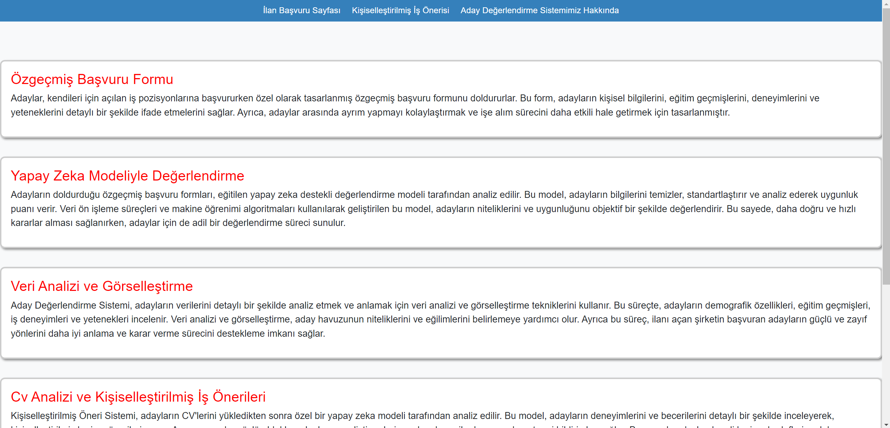

## 🔧 Admin Paneli

### 📈 Aday Değerlendirme

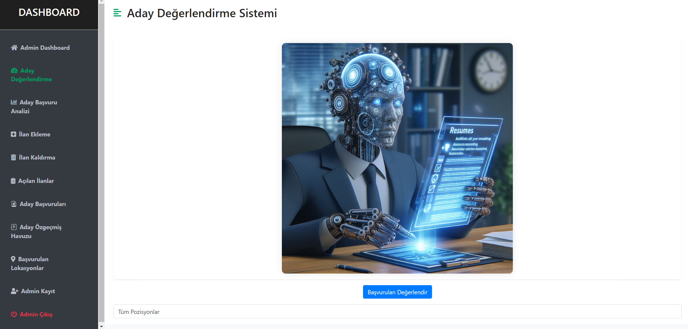

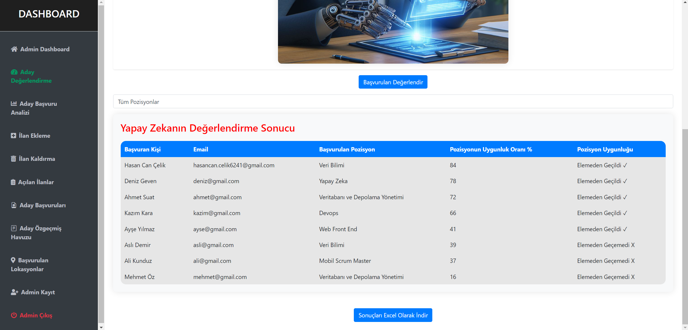

Admin panelindeki Aday Değerlendirme sayfasında, ilgili pozisyonlara başvuran adaylar yapay zeka modeli ile değerlendirilir ve uygunluk oranı belirlenir. Değerlendirme sonuçları bir tablo halinde gösterilir ve pozisyona göre filtreleme işlemleri yapılabilir. Bu tablo, adayın ismi, e-posta adresi, başvurduğu pozisyon, uygunluk skoru ve elemeden geçip geçmediği bilgilerini içerir. Filtrelemelere göre tabloyu Excel formatında indirme seçeneği de bulunmaktadır.

#### Model Detayları

- **Model:** TF-IDF ve cosine_similarity
- **Süreç:** Aday ve ilan bilgileri TF-IDF vektörü ile sayısal arrayler haline getirilir ve cosine_similarity ile benzerlik oranları başvurulan pozisyona göre kategorize edilerek hesaplanır.
- **Ön İşleme Adımları:** Metindeki gramer hatalarının giderilmesi, tüm metnin küçük harflere dönüştürülmesi, özel karakterlerin ve noktalama işaretlerinin temizlenmesi, ve son olarak PorterStemmer algoritması kullanılarak kelimelerin köklerine indirgenmesi.

### 📉 Aday Başvuru Analizi

Aday Değerlendirme Sistemi, adayların verilerini detaylı bir şekilde analiz etmek ve anlamak için veri analizi ve görselleştirme tekniklerini kullanır. Bu süreçte, adayların demografik özellikleri, eğitim geçmişleri, iş deneyimleri ve yetenekleri incelenir. Veri analizi ve görselleştirme, aday havuzunun niteliklerini ve eğilimlerini belirlemeye yardımcı olur. Ayrıca bu süreç, Şirketin açmış olduğu ilana başvuran adayların güçlü ve zayıf yönlerini daha iyi anlama ve karar verme sürecini destekleme imkanı sağlar. Bu sayfada, başvurulara göre pozisyonların dağılımı, başvuranların yabancı dil dağılımı, pozisyonlara göre ortalama iş deneyimi, pozisyonlara göre başvuranların eğitim seviyesi dağılımı, başvuranların eğitim seviyesi dağılımı, pozisyon ve teknoloji ilişkisi, pozisyonlara ve eğitim seviyelerine göre iş deneyimi, başvuranların ikametgah dağılımı, yabancı dil ve seviyelerine göre dağılım ve wordcloud ile başvuran adayların genel olarak bildiği teknolojiler gibi çeşitli veri görselleştirmeleri yapılır. Bu görselleştirmeler interaktif grafikler şeklinde kullanıcıya sunulur.

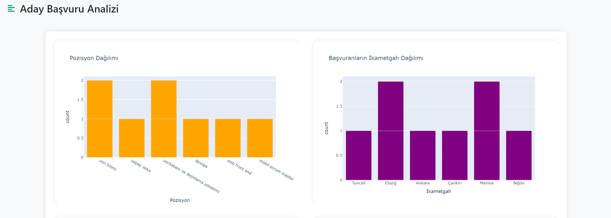
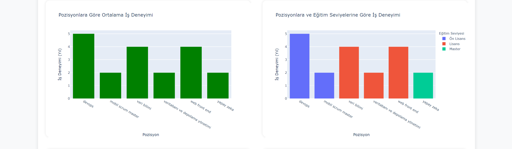
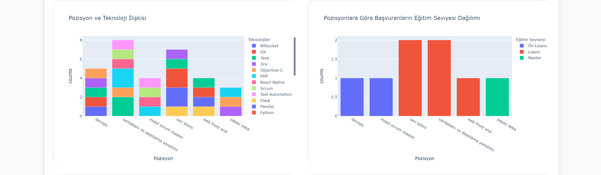
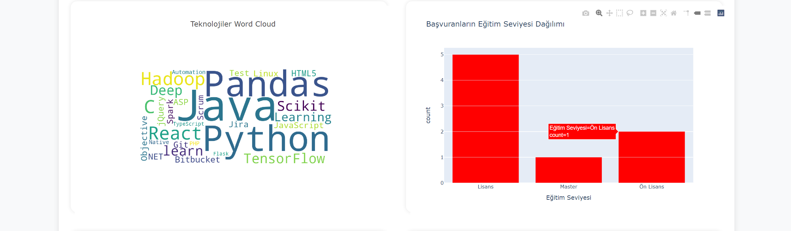

### ➕ İlan Ekleme ve ➖ Kaldırma

#### ➕ İlan Ekleme

İlan Ekleme sayfasında, yöneticinin belirlediği kriterlere göre yeni iş ilanları ekleyebileceğiniz bir form bulunmaktadır.

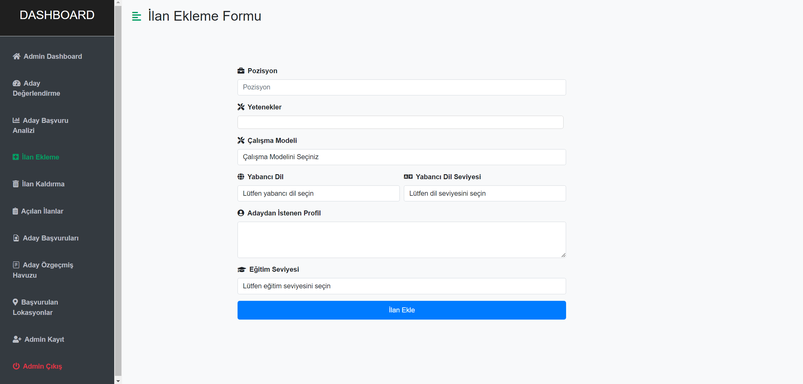

#### ➖ İlan Kaldırma

İlan Kaldırma sayfasında ise eklenen ilanların kaldırılması işlemleri gerçekleştirilir.

### 📂 Açılan İlanlar

Şirketin eklediği ilanların görüntülenmesi ve yönetimi gerçekleştirilir.

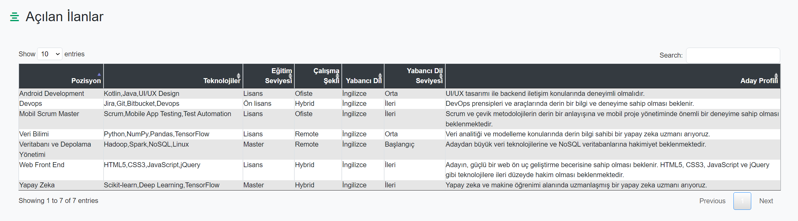

### 📄 Aday Başvuruları ve Özgeçmiş Havuzu

####📄 Aday Başvuruları

Aday Başvuruları sayfasında, ilan başvuru sayfasında adayların doldurduğu bilgiler bulunmaktadır.

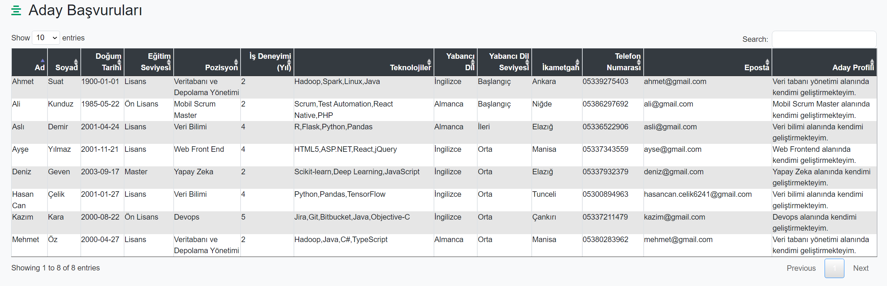

####📄 Özgeçmiş Havuzu

Özgeçmiş Havuzu sayfasında, adayların ilan başvuru sayfasında sisteme yükledikleri CV'lerin görüntülenmesi ve indirilmesi gibi seçenekler bulunmaktadır. Bu sayfadaki tablolar, yöneticinin işini kolaylaştırmak için çeşitli özel fonksiyonlara sahiptir.

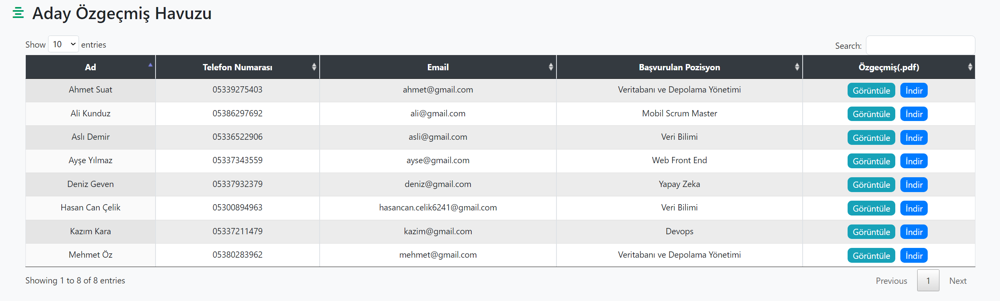

### 🌍 Başvurulan Lokasyonlar

Başvurulan Lokasyonlar sayfasında, ilanlara başvuran adayların hangi bölgelerden başvurduklarını dünya haritası üzerinde görebilirsiniz. Harita üzerinde şirketin konumu ve logosu da gösterilmektedir. Adayların başvurdukları lokasyonlar kırmızı ikon, şirket ise mavi ikon ile belirtilir. Konumların üzerine tıkladığınızda, ilgili konumda başvuran adayların bilgileri ve konumun ismi pop-up ekranında gösterilir.

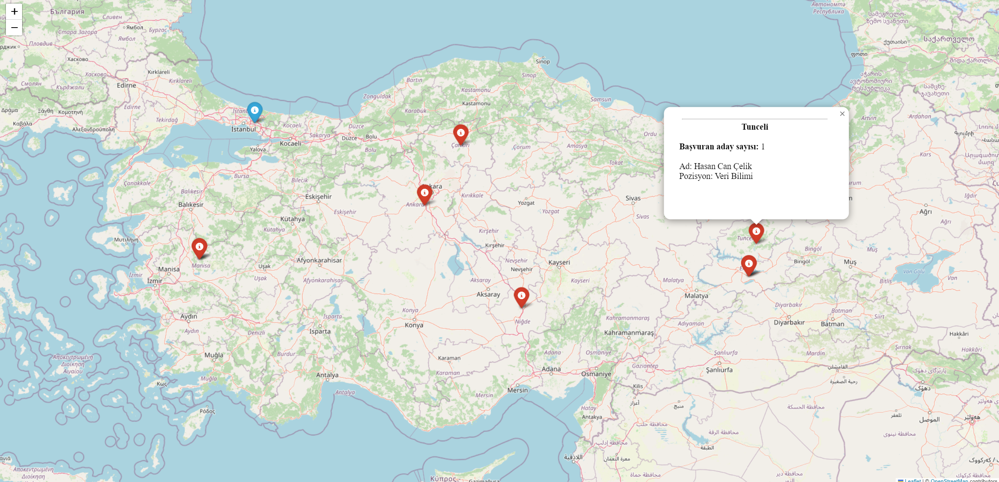

### 👨‍💼 Yönetici Ekleme Sayfası

Sisteme kayıtlı admin kullanıcısının, yeni bir yönetici kaydedebilmesi için doldurması gereken form bulunmaktadır.

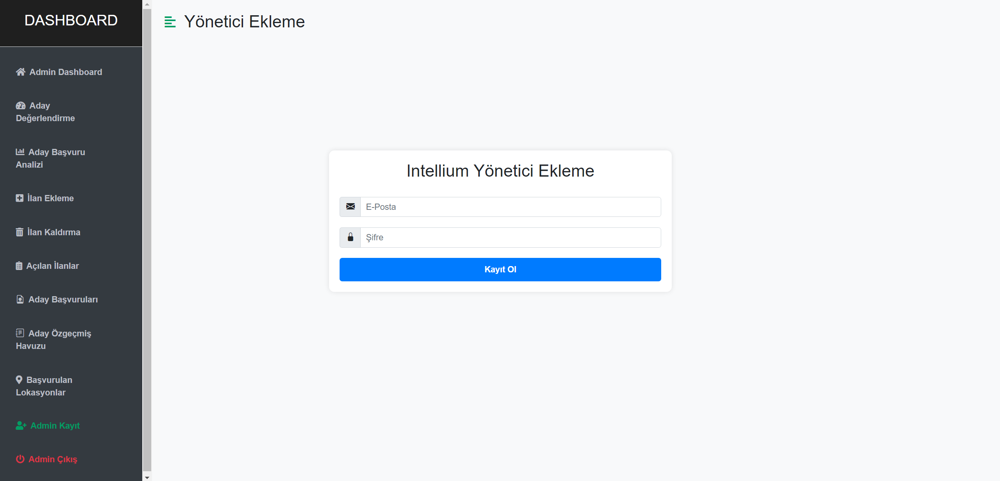

## 🔒 Güvenlik Önlemleri

- **Veri Tabanı Yönetimi:** Veriler veri tabanlarında tutulur ve ihtiyaç halinde çağrılır. Bu, performans avantajı sağlar.
- **SQL Injection Önlemleri:** Parametreli yapı kullanılarak SQL injection saldırılarının önüne geçilir.
- **Oturum Yönetimi:** Admin 20 dakika boyunca işlem yapmazsa oturum otomatik olarak kapatılır. Ayrıca, bir oturum açılmamışsa URL ile admin sayfalarına erişim engellenmiştir.
- **XSS Saldırıları:** Proje, XSS saldırılarına karşı gerekli önlemleri içerir.

## 🛠️ Kullanılan Teknolojiler

- **Backend:** Python, Flask
- **Frontend:** HTML, Bootstrap, CSS, JavaScript
- **Database:** SQL Server
- **Machine Learning:** Scikit-learn, Logistic Regression, cosine_similarity, pickle, TfidfVectorizer, naive bayes
- **Data Preprocessing:** NLTK, Pandas, Numpy, TurkishMorphology, re, PorterStemmer,PyPDF2
- **Visualization:** Matplotlib, Seaborn, Plotly, matplotlib, folium, plotly.express, WordCloud

## 📖 Kullanım

1. **Kullanıcı Arayüzü:**

   - İlan başvuru formunu doldurun.
   - CV'nizi yükleyerek kişiselleştirilmiş iş önerisi alın.
   - Aday değerlendirme sayfasında bilgileri görüntüleyin.

2. **Admin Paneli:**
   - Aday değerlendirme ve başvuru analizlerini yapın.
   - İlan ekleyin veya kaldırın.
   - Başvuruları ve CV'leri yönetin.
   - Başvuru lokasyonlarını görüntüleyin.
